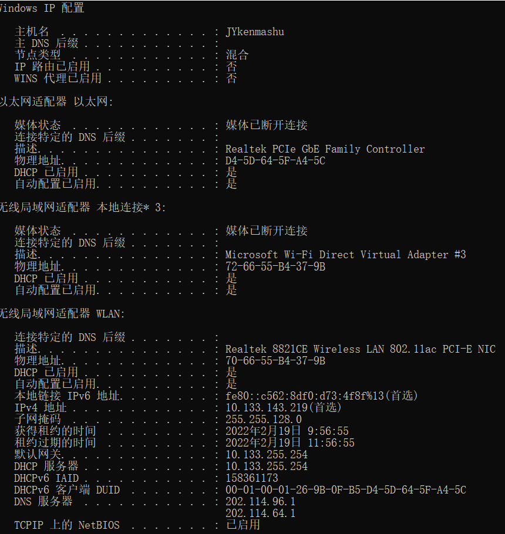
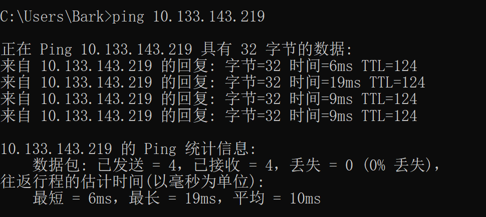

武汉大学计算机学院本科生实验报告

ping另外一台计算机

> 课程：计算机网络
>
> 学号：2020302111274
>
> 姓名：杨俊奇

[TOC]

## 1. 实验目的

​		ping的功能是用于测试网络。可以ping自己的电脑或其它的电脑，本次实验的目的是ping另外一台电脑，得到另一台电脑的响应。

## 2. 实验环境

​		Windows 10

## 3. 实验步骤

1. **获得另一台电脑的IP地址**

   ​		首先在另一台电脑的开始菜单中找到运行选项并点击，或者Win+R，然后在出现的运行窗口中，输入cmd，点击确定，弹出命令控制台。在命令控制台里输入 “ipconfig/all”，显示的IPv4地址就是所需的IP地址。

   

2. **打开自己电脑的控制台**

   ​		在自己电脑开始菜单中点击运行选项，或Win+R，在运行窗口中输入cmd，确定，进入命令控制台。

   

3. **输入ping指令**

   ​		在命令控制台中输入“ping 10.133.143.219”，即可完成ping另外一台电脑。

## 4. 实验结果与总结

​		通过以上操作，可得到实验结果：

	通过本次实验，掌握了ping的用法，学会了ping另外一台电脑的方法步骤，也更加理解ping命令。